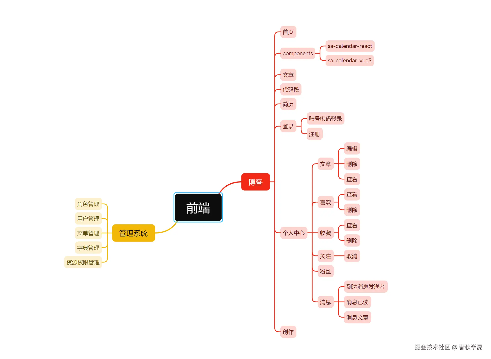
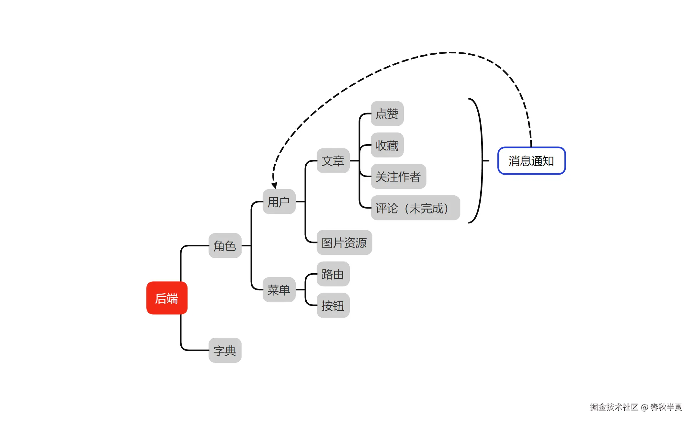

在线预览：https://www.sa-blog.online/home

作为一名技术爱好者，拥有一个功能完善、美观且高效的个人博客是展示专业能力和分享见解的理想方式。下面我将从用户体验和技术实现角度，解析如何使用 React 和 Tailwind CSS 构建一个令人印象深刻的博客平台。

用来尝试NestJs框架搭建的博客，NestJS 作为一款渐进式 Node.js 框架，凭借其企业级架构设计与开箱即用的生态，成为我开发博客后端服务的核心选择。

其模块化设计（@Module）与依赖注入（DI）机制，使得代码分层清晰，结合TypeORM实现数据层高效管理，JWT与Passport模块无缝集成身份认证，保障系统安全。通过@nestjs/swagger自动生成 API 文档，配合Redis缓存与Throttler限流，显著提升接口性能。

NestJS 深度整合 TypeScript 的强类型特性，结合class-validator实现请求数据验证，减少潜在错误。无论是基于Express的高并发处理能力，还是通过WebSocket实现实时交互，NestJS 都为博客系统提供了灵活、可维护的架构基础，完美支撑从用户管理到内容发布的全场景需求。

前端用来尝试一种只提供逻辑的ui组件库，使用到了React、Tailwindcss、Radix UI、Aceternity UI、Vite、TypeScript、Socket.Io





## 前端
- react
- vite
- typescript
- tailwindcss
- axios
- @radix-ui
- zustand
- zod

### 目录介绍
```shell
/src
  |- /api           # 接口
  |- /assets        # 静态资源
  |- /components    # 公用组件
  |- /constant      # 一些常量，路由，菜单数组等等
  |- /hooks         # 自定义hooks
  |- /lib       
  |- /provider      # 一些系统功能方法
  |- /stores        # 全局状态store
  |- /types         # 存放ts类型（后端DTO）
  |- /views         # 页面文件夹
  |- App.tsx        # app入口
  |- index.css      # css主题色
  |- main.tsx       # 应用文件
  |- vite-env.d.ts  # ts扩展
.env.development    # 开发环境变量
.env.production     # 生产环境变量
```

## 后端
gitee https://gitee.com/yin-chunyang/blog-service

github https://github.com/MC-YCY/blog-service

- nestjs
- typescript
- nest-cli
- mysql2
- socket.io
- typeorm

### 目录介绍

```shell
/src
  |- /api             # 所有的controller
  |- /config          # 一些配置
  |- /notification    # 消息通知相关实体，网关
  |- /shared          # 非消息通知所有的entity，dto，service等
  |- /types           #
  │- app.module.ts    # app入口
  │- main.ts          # 启动文件
.env.development      # 开发环境变量
.env.production       # 生产环境变量
```

## 管理系统

https://gitee.com/yin-chunyang/blog-manage

- 字典
- 角色
- 用户
- 菜单
- 资源