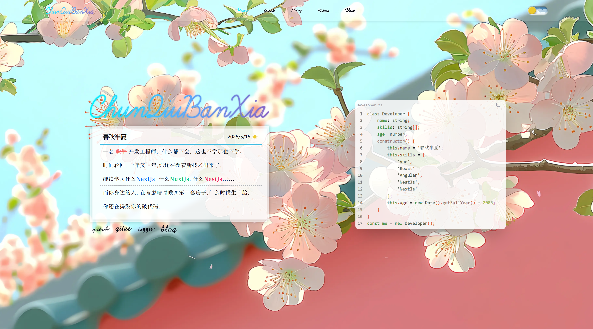

next-blog迁移版本，主要样式挺好看，加上master分支的接口联调一下

preview:http://47.93.248.11:3100/


- react
- vite
- typescript
- tailwindcss
- axios
- @radix-ui
- zustand
- zod

## 目录说明
```shell
/src
  |- /api           # 接口
  |- /assets        # 静态资源
  |- /components    # 公用组件
  |- /constant      # 一些常量，路由，菜单数组等等
  |- /hooks         # 自定义hooks
  |- /lib       
  |- /provider      # 一些系统功能方法
  |- /stores        # 全局状态store
  |- /types         # 存放ts类型（后端DTO）
  |- /views         # 页面文件夹
  |- App.tsx        # app入口
  |- index.css      # css主题色
  |- main.tsx       # 应用文件
  |- vite-env.d.ts  # ts扩展
.env.development    # 开发环境变量
.env.production     # 生产环境变量
```

**next.js版本：**

https://sa-next-blog.netlify.app/

https://github.com/MC-YCY/next-blog